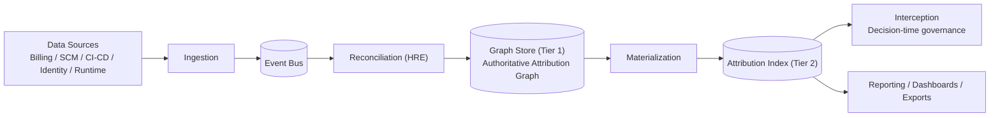
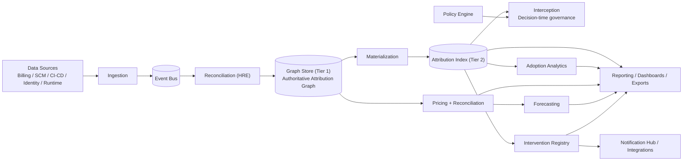

# Argmin

Decision-time AI cost governance platform for enterprise AI spend attribution, intervention, and governance.

## Why This Exists

Enterprise AI spend is visible at cloud-account granularity but usually not attributable to the team/workload level needed for governance, chargeback, and intervention. Argmin closes that gap by combining:

- Immutable multi-source event ingestion.
- Heuristic reconciliation with calibrated confidence.
- Materialized O(1) attribution index for hot-path decisions.
- Safe interception with strict fail-open semantics.

## Demo First (Recommended)

### Run locally (30-second path)

Prerequisites:

- Python `3.12+`
- `bash`

Get into the repository root first.

If you cloned the repository:

```bash
git clone https://github.com/argmin-com/argmin-demo.git
cd argmin-demo
```

If you downloaded the ZIP from GitHub:

```bash
cd /path/to/where/you/unzipped/argmin-demo
```

You are in the correct directory if `ls` shows files such as:

- `README.md`
- `pyproject.toml`
- `scripts/`
- `frontend/`

```bash
./scripts/run_demo.sh
```

Open the demo:

- `http://localhost:8000/platform/`

If port `8000` is occupied:

```bash
ACI_DEMO_PORT=8010 ./scripts/run_demo.sh
```

Then open `http://localhost:8010/platform/`.

To restore a running demo to the same seeded state before another recording or
stakeholder walkthrough:

```bash
ACI_DEMO_PORT=8010 ./scripts/reset_demo.sh
```

You can also open `http://localhost:8010/platform/?reset=1` to clear browser
session state and ask the local backend to reload the fixed demo baseline.

If you prefer not to `cd` into the repo first, you can also launch it with an
absolute path:

```bash
/absolute/path/to/argmin-demo/scripts/run_demo.sh
```

`./scripts/run_demo.sh` launches the explicit `demo` profile:

- single worker
- in-memory graph/event/index backends
- deterministic startup seeding
- auth bypass enabled only for the demo profile
- outbound notifications forced to simulation mode

The demo launcher refuses `ACI_ENVIRONMENT=production` or `ACI_ENVIRONMENT=staging`
and forces local-only memory backends so cloud or shared-backend shell variables
cannot leak into an investor or design-partner walkthrough.

The dashboard and control-plane views are populated on startup. Use **Reset Demo**
in the Guided Demo drawer to restore the baseline presentation state, or
**Initialize Demo** if you want to reseed backend demo data during a walkthrough.
If the local demo runtime is unavailable during initialization, the walkthrough
continues on deterministic local demo data so the story still plays cleanly.

In the UI:

1. Open **Guided Demo** from the top bar.
2. Click **Start Full Walkthrough**.
3. Narrate the walkthrough in the same product-proof order the UI uses:
   - Overview
   - PRD Proof
   - Coverage
   - Employee Adoption
   - Request Proof
   - Exports
   - Interventions
   - Energy
   - Forecasting
   - Governance
   - Admin
4. If the forecast API is unavailable, the Forecasting view continues using a
   local directional estimate derived from the demo dataset and scenario
   assumptions.
5. Use the persistent audience lens and active-context ribbons to keep the same
   request, team, model, and intervention visible as you move between views.
6. Navigate the left rail across:
   - Overview
   - PRD Proof
   - Coverage
   - Employee Adoption
   - Models
   - Teams
   - Manual Mapping
   - Interventions
   - Exports
   - Energy
   - Forecasting
   - Governance
   - Integrations
   - Admin
   - Request Proof
   - Glossary
   - FAQ

For the API-level walkthrough, use [docs/demo-guide.md](docs/demo-guide.md).
For the view-by-view demo reference, see [docs/demo-feature-matrix.md](docs/demo-feature-matrix.md).
For policy semantics and enforcement behavior, see [docs/policy-reference.md](docs/policy-reference.md).
For ingestion contracts and examples, see [docs/ingestion-reference.md](docs/ingestion-reference.md).
For automated end-to-end demo verification, run `./scripts/smoke_demo.sh`.
For a non-destructive state reset against an already running demo, run
`./scripts/reset_demo.sh`.

The launcher installs the minimal local-demo dependency set from
`requirements-demo.lock` into `.venv` on the first run and reuses it until
`requirements-demo.lock` or `pyproject.toml` changes. It runs from `src/`
directly, so the 30-second demo path does not perform an editable package build
or install cloud/shared-backend clients. Set `ACI_DEMO_REQUIREMENTS_FILE=requirements.lock`
only when you intentionally want the full production/development dependency
set, and set `ACI_DEMO_SKIP_INSTALL=1` only when the local environment is
already prepared.

## Runtime Profiles

### Demo profile

- Launcher: `./scripts/run_demo.sh`
- Compose: `docker compose -f docker-compose.demo.yml up --build`
- Backend selection:
  - `ACI_GRAPH_BACKEND=memory`
  - `ACI_EVENT_BUS_BACKEND=memory`
  - `ACI_INDEX_BACKEND=memory`
  - `ACI_INTERCEPTOR_CIRCUIT_STATE_BACKEND=local`

This is the recommended profile because it is deterministic,
single-process, and pre-seeded.

### Shared-backend profile

- Compose: `docker compose up --build`
- Backend selection:
  - `ACI_GRAPH_BACKEND=neo4j`
  - `ACI_EVENT_BUS_BACKEND=kafka`
  - `ACI_INDEX_BACKEND=redis`
  - `ACI_INTERCEPTOR_CIRCUIT_STATE_BACKEND=redis`

This path exercises the durable/shared topology. It is the right local profile for validating
backend wiring rather than for the shortest-path demo.

Validate the shared-backend profile without cloud access:

```bash
./scripts/smoke_stack.sh
```

The shared-backend Docker stack uses local Redis, Kafka, and Neo4j containers
with dummy local credentials by default. Override those values only for a
dedicated development environment; the 30-second demo path above does not need
Docker or cloud credentials.

## Platform Architecture

The architecture is easiest to read in two layers:

- the core attribution and decision-time path
- the surrounding platform services that make the product operationally useful

### Core Attribution and Decision-Time Path

This is the data plane that turns raw enterprise telemetry into a low-latency
decision surface for interception and reporting.



### Platform Services

The same core data plane also feeds the pricing, analytics, planning,
intervention, and integration surfaces that appear in the product runtime.



## Technical Guarantees

- Interceptor never performs synchronous graph traversal or remote policy RPC on the hot path.
- Fail-open behavior protects application availability under timeout/error conditions.
- Schema validation occurs before events enter the append-only bus.
- Policy and intervention decisions emit immutable audit events.
- Shared-backend mode supports Kafka, Redis, and Neo4j adapters behind explicit config.
- Pricing rules, reconciliation records, and intervention lifecycle state can run
  in memory for demo use or on Redis-backed durable storage for multi-pod runtime.

## API Surface

### Public operational endpoints

- `GET /`
- `GET /health`
- `GET /live`
- `GET /ready`
- `GET /metrics`
- `GET /metrics/prometheus`

### Authenticated API endpoints (`/v1/*`)

- `POST /v1/events/ingest`
- `POST /v1/events/ingest/batch`
- `POST /v1/intercept`
- `POST /v1/trac`
- `POST /v1/policy/evaluate`
- `POST /v1/demo/bootstrap` (non-production only)
- `POST /v1/demo/reset` (non-production only)
- `POST /v1/demo/mode` (non-production only)
- `GET /v1/attribution/{workload_id}`
- `POST /v1/attribution/manual`
- `GET /v1/index/lookup?key=...`
- `GET /v1/index/stats`
- `GET /v1/dashboard/overview`
- `GET /v1/adoption/hierarchy`
- `GET /v1/adoption/dashboard`
- `GET /v1/pricing/catalog`
- `POST /v1/pricing/catalog`
- `POST /v1/pricing/estimate`
- `POST /v1/finops/synthetic`
- `POST /v1/finops/reconcile`
- `GET /v1/finops/drift`
- `POST /v1/forecast/spend`
- `GET /v1/interventions`
- `GET /v1/interventions/summary`
- `GET /v1/interventions/{intervention_id}/history`
- `POST /v1/interventions/{intervention_id}/status`
- `POST /v1/interventions/cost-simulate`
- `GET /v1/integrations/overview`
- `POST /v1/integrations/scenarios/{scenario_id}/dispatch`
- `POST /v1/integrations/notify`
- `GET /v1/integrations/deliveries`

## Security Posture

Implemented controls include:

- JWT auth on `/v1/*` (issuer/audience/scope/tenant validation).
- JWT signing algorithms are explicitly allowlisted, and asymmetric algorithms
  require a configured public key when auth bypass is disabled.
- Additional mutation scopes for pricing catalog writes, intervention lifecycle
  changes, and live outbound notification delivery.
- Startup-time guardrails preventing unsafe production config.
- Ingestion rate limiting and batch-size bounds.
- Durable-bus idempotency with tenant-scoped dedup keys.
- HTTPS allowlisting and private-target blocking for live webhook delivery.
- Kubernetes security baseline (`runAsNonRoot`, dropped capabilities, read-only root filesystem, probes, PDBs, network policies).
- Dependency and static-analysis gates in CI (ruff, strict mypy, pytest, CodeQL, dependency review).

See:

- [SECURITY.md](SECURITY.md)
- [docs/architecture.md](docs/architecture.md)
- [docs/policy-reference.md](docs/policy-reference.md)
- [docs/ingestion-reference.md](docs/ingestion-reference.md)
- [docs/releasing.md](docs/releasing.md)

## Performance and Validation

- Latency and fail-open validation suite: `tests/glass_jaw/`
- Unit/integration coverage across API, event bus, graph, policy, interception, and regression controls.

Run quality gates locally:

```bash
./scripts/validate_local.sh
```

Set `ACI_VALIDATE_FULL=1` to include integration and glass-jaw tests. Set
`ACI_VALIDATE_SMOKE=1` to include the end-to-end local demo smoke test. The
script installs dev/test dependencies only when `requirements-dev.lock` or
`pyproject.toml` changes.

## CI/CD and Release Workflows

GitHub Actions workflows under `.github/workflows/`:

- `ci.yml`: lint, strict mypy, dependency review, lockfile consistency, unit/integration/latency tests, Docker smoke, and SBOM artifact.
- `codeql.yml`: static analysis.
- `dependency-review.yml`: dependency risk gate on PRs.
- `cache-hygiene.yml`: periodic cache maintenance.
- `release.yml`: manual SemVer release dispatch — quality gate, artifact assembly, immutable tag creation, and GitHub release publication.

For the release operator guide, see [docs/releasing.md](docs/releasing.md).

## Repository Layout

```text
src/aci/
  api/            FastAPI service and auth middleware
  core/           Event bus, orchestration, schema validation
  hre/            Heuristic reconciliation engine
  graph/          Graph store abstraction
  index/          Materialization and serving index
  interceptor/    Fail-open gateway and circuit breaker
  policy/         Governance policy engine
  trac/           TRAC calculations
  equivalence/    Model equivalence verification
  models/         Domain models

frontend/         Investor-facing demo UI
k8s/base/         Reference Kubernetes manifests
infra/onboarding/ CloudFormation/Terraform onboarding templates
docs/             Technical documentation
tests/            Unit, integration, and latency/fail-open validation suites
wiki-src/         GitHub wiki source
```

## Wiki

- [wiki-src/Home.md](wiki-src/Home.md)
- [wiki-src/Technical-Architecture.md](wiki-src/Technical-Architecture.md)
- [wiki-src/Security-and-Trust-Boundary.md](wiki-src/Security-and-Trust-Boundary.md)
- [wiki-src/Operations-and-Deployment.md](wiki-src/Operations-and-Deployment.md)
- [wiki-src/Technical-Due-Diligence-Guide.md](wiki-src/Technical-Due-Diligence-Guide.md)
